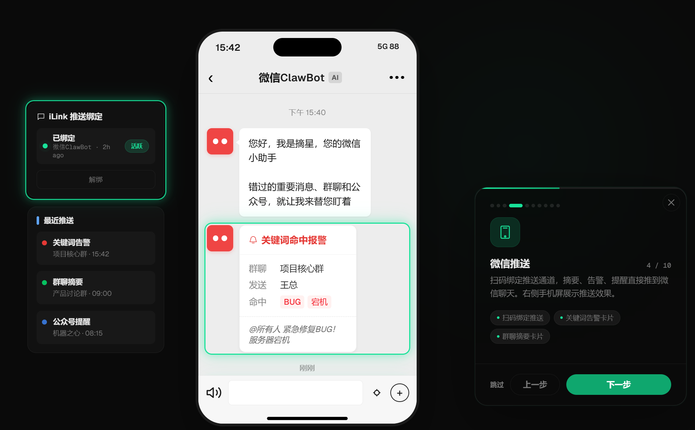
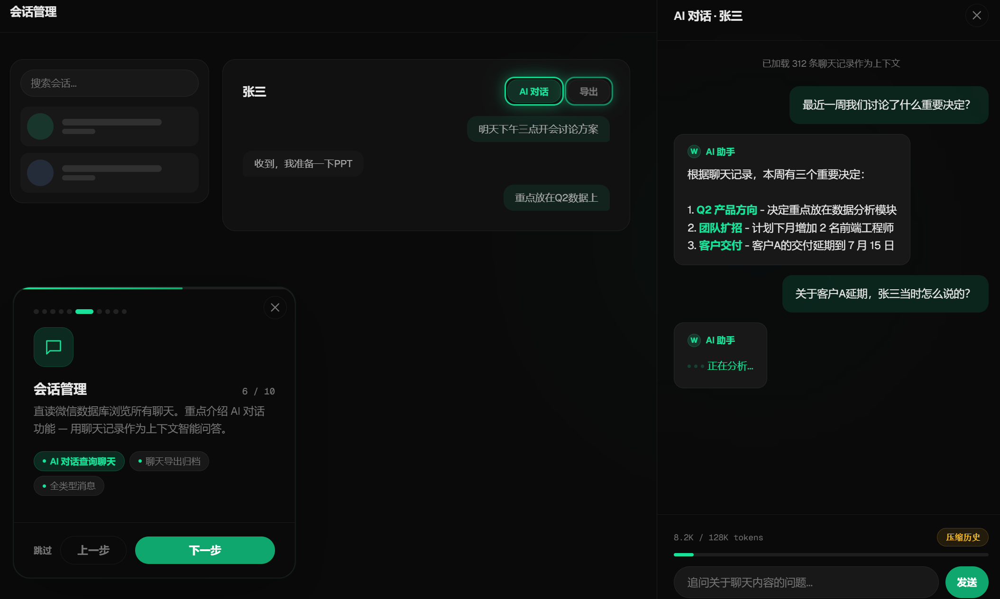
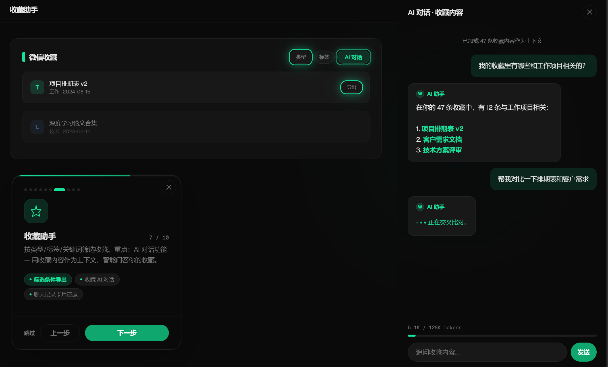
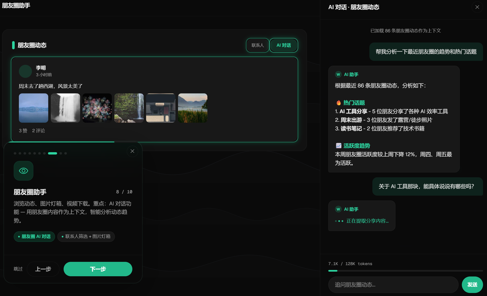
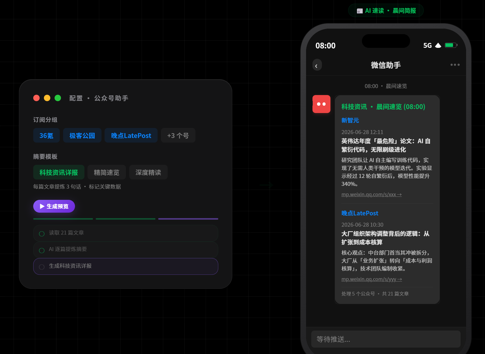

<div align="center">

# 摘星 · 微信助手

从海量消息里，摘出最值得关注的。

**关键词提醒 · AI 群摘要 · 公众号速读 · 收藏整理 · AI 对话 · 朋友圈归档 · 聊天导出**

[在线体验](https://wx-assist-demo.onrender.com) · [技术文档](doc/) · [下载](https://github.com/MaleleStudySpace/wx-assist/releases)

</div>

---

群里有人问"今晚聚餐去哪吃"，你看到时已经散场了。
收藏了 500 条内容，想找那条"上次记的笔记在哪"，翻了 20 分钟也翻不到。
关注了一堆公众号，每天的推送翻都翻不完，越积越多——最后索性不看了。

微信不会提醒你，不会帮你整理，不会帮你导出。
它只会让红点越来越多，让收藏越来越深，让重要消息越来越远。

---

## 功能

- **关键词提醒** — 在指定群聊设置关注词，命中后通过 iLink 推送微信私聊
- **群聊 AI 摘要** — 定时拉取群消息，AI 生成结构化摘要，标注待办与决定
- **公众号助手** — 按主题分组，AI 定时汇总文章生成摘要，推送更新提醒
- **收藏整理** — 浏览、搜索、筛选收藏内容，AI 对话查询，一键导出
- **朋友圈归档** — 导出为离线 HTML，图片视频完整保留，AI 回顾动态
- **AI 对话** — 基于聊天记录 / 收藏 / 朋友圈的上下文对话
- **聊天导出** — 打包聊天记录为离线 HTML 档案，含文字、图片、语音、视频

## 在线体验

> **零安装，零配置，打开即用。**

👉 [点击进入 Demo](https://wx-assist-demo.onrender.com)

Demo 使用模拟数据，AI 功能真实调用。响应式设计，手机也能用。

## 截图
<div align="center">

#### 绑定微信



#### 会话管理



#### 收藏助手



#### 朋友圈归档



#### 公众号助手


</div>

## 模块架构

```
┌──────────────────────────────────────────────────────────────┐
│                         Web UI                               │
│  运行状态 · 群聊助手 · 会话管理 · 收藏助手 · 朋友圈 · 公众号     │
└──────────────────────────────────────────────────────────────┘
                              │
┌──────────────────────────────────────────────────────────────┐
│                      功能模块                                 │
│  关键词提醒  群聊AI摘要  公众号速读  公众号即时提醒              │
│  收藏整理    朋友圈归档  聊天导出    AI对话                     │
└──────────────────────────────────────────────────────────────┘
                              │
┌──────────────────────────────────────────────────────────────┐
│                      核心服务                                 │
│  消息路由 · 定时调度 · AI后端 · 群记忆 · 通知队列 · iLink推送    │
└──────────────────────────────────────────────────────────────┘
                              │
┌──────────────────────────────────────────────────────────────┐
│                      数据层                                   │
│              微信本地数据库 · 本地存储 (SQLite)                │
└──────────────────────────────────────────────────────────────┘
                              │
                         ┌────┴────┐
                         │ 微信私聊 │ ← iLink 推送
                         └─────────┘
```

## 技术说明

目前仅支持 Windows 平台。核心数据处理在本机完成，不使用 AI 功能时聊天记录、收藏、朋友圈等数据不会离开本机。使用 AI 功能时，相关上下文会按用户配置发送至对应的第三方 AI API。

详细架构与公开技术说明见 [doc/](doc/) 目录。

技术栈：Python 3.13 · React 19 · Tailwind 4 · PyInstaller

## 快速开始

**下载 exe**

从 [Releases](https://github.com/MaleleStudySpace/wx-assist/releases) 下载最新 `wx-assist.exe`，双击运行即可。

**从源码启动桌面应用**

需要 Python 3.13+、Node.js 18+、微信电脑版。

```powershell
pip install -r requirements.txt
cd ui && npm install && npm run build && cd ..
python desktop.py
```

首次启动进入引导流程，按提示操作即可。

## 致谢

本项目在 AI 辅助编程下完成，底层实现参考了多个优秀开源项目。在此对以下前辈及开源贡献者表示最诚挚的感谢：

- **[cancelGuMu/webot](https://github.com/cancelGuMu/webot)** · **[hicccc77/WeFlow](https://github.com/hicccc77/WeFlow)** · **[jackwener/wx-cli](https://github.com/jackwener/wx-cli)** · **[ylytdeng/wechat-decrypt](https://github.com/ylytdeng/wechat-decrypt)** — 为本项目的框架和底层实现提供了思路和指导。

正是你们，让我的想法得以实现，让这一切成为可能，再次感谢。

如果有好的建议或发现了问题，欢迎提交 Issue 或 PR。

## 免责声明

1. 本项目主要面向个人本地使用。核心数据处理在本机完成；使用 AI 功能时，相关上下文会按用户配置发送至对应的第三方 AI API。请自行做好数据备份。
2. 仅供个人学习与本地使用。使用者应遵守相关法律法规及微信用户协议。
3. 按"现状"提供，不提供任何明示或暗示的保证。

   > **安全提示：** 部分杀软可能将编译后的可执行文件误报为威胁，此属 PyInstaller 打包工具的常见现象，请以排除项方式信任使用。

4. AI 功能依赖第三方 API 服务（如 DeepSeek / Claude），请遵守对应服务商协议。
